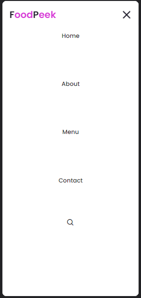

<h1 align="center">Hamburger Restaurant Landing Page:</h1>

## 📖 About the project
In this project, I created a website for a fast-food business. I designed a simple and straightforward layout that is both intuitive and visually appealing. 
By applying UI/UX principles, I ensured that the website's structure is responsive across various screen sizes and devices. 
Additionally, when the media query is activated, the "hamburger menu" type is displayed.


### Hamburger menu type


## 🦾 Technologies used
<div style="display: flex;">
  


</div>

## 🤔 What i learned
- I learned more about HTML & CSS architecture.
- Now I know one way of how to create a "hamburger menu."
- I improved my skills in media queries.
- I designed the final image (milkshake) using AI image generation.
- Lastly, I gained a better understanding of manipulating CSS classes.

## 👽 How to clone this project

````bash
    # Select where you want to clone
    $ cd ~/Documents
````

````bash
    # Clone the project
    $ git clone https://github.com/DevGustavus/form_login_cadastro.git
````

````bash
    # Check if cloning worked fine
    $ cd ~/Documents/form_login_cadastro
    $ ls
````
